<div align="center">

  

  <h1>Markdown Viewer</h1>

  **A Premium Browser-Based Markdown Editor, Viewer, and Reader.**

  *Open, read, edit, and preview `.md` files with split-screen live preview, sync scrolling, GitHub-Flavored Markdown, diagrams, LaTeX, syntax highlighting, PDF/HTML/PNG export, and multi-tab support across web, desktop, and Docker.*

  [](https://github.com/ThisIs-Developer/Markdown-Viewer/blob/main/LICENSE)
  [](https://github.com/ThisIs-Developer/Markdown-Viewer/releases)
  [](https://github.com/ThisIs-Developer/Markdown-Viewer/commits/main)
  [](https://github.com/ThisIs-Developer/Markdown-Viewer/stargazers)

  <p>
    <a href="https://codewiki.google/github.com/thisis-developer/markdown-viewer" target="_blank" rel="noopener noreferrer">
      
    </a>
    <a href="https://deepwiki.com/ThisIs-Developer/Markdown-Viewer" target="_blank" rel="noopener noreferrer">
      
    </a>
    <a href="https://oosmetrics.com/repo/ThisIs-Developer/Markdown-Viewer" target="_blank" rel="noopener noreferrer">
      
    </a>
  </p>

  🌐 **English** • [简体中文](locales/README_zh.md) • [日本語](locales/README_ja.md) • [한국어](locales/README_ko.md) • <a href="wiki/Localization.md">More Languages</a>

  [Live Production Demo](https://markdownviewer.pages.dev/) • [Documentation Wiki](wiki/Home.md) • [Issue Tracker](https://github.com/ThisIs-Developer/Markdown-Viewer/issues) • [Releases](https://github.com/ThisIs-Developer/Markdown-Viewer/releases)

</div>

<p align="center">
  
</p>


## Table of Contents

<details>
  <summary>📂 <b>Table of Contents</b> (Click to expand)</summary>
  <br />

  - [About the Project](#about-the-project)
  - [Current Behavior and Privacy](#current-behavior-and-privacy)
  - [Key Features](#key-features)
  - [System Architecture](#system-architecture)
    - [High-Level Architecture Diagram](#high-level-architecture-diagram)
    - [Core File Walkthrough](#core-file-walkthrough)
  - [Getting Started & Installation](#getting-started--installation)
  - [Usage Guide & Keyboard Shortcuts](#usage-guide--keyboard-shortcuts)
  - [Project Directory Structure](#project-directory-structure)
  - [Built With (Technology Stack)](#built-with-technology-stack)
  - [Contributing & Code Quality](#contributing--code-quality)
  - [Showcase & Community Projects](#showcase--community-projects)
  - [Contributors](#contributors)
  - [📈 Development Journey](#-development-journey)
  - [License](#license)
  - [Contact & Support](#contact--support)
</details>

---

## About the Project

**Markdown Viewer** is a premium browser-based Markdown editor, viewer, reader, and previewer optimized for professional documentation workflows. It opens local `.md` and `.markdown` files, lets you write in plain Markdown, and renders GitHub-Flavored Markdown (GFM), math formulas, diagrams, code blocks, tables, and other rich Markdown content in a split-screen live preview with sync scrolling.

Designed with privacy and performance at its core, the application keeps ordinary editing, previewing, autosave, and most exports on your device, performs heavy parsing in a background worker thread, uses incremental DOM patching to minimize browser repaints, and supports offline-capable PWA behavior after the web build has cached its assets. It is also packaged as a lightweight native desktop shell using the Neutralinojs framework.

---

## Current Behavior and Privacy

Markdown Viewer is not a cloud workspace. Normal typing, preview rendering, local file import, tab autosave, theme settings, and most exports happen on your device. No account is required. The app does not implement analytics, telemetry, ads, or tracking cookies.

Some user-triggered features do use the network:

- **GitHub import** fetches public Markdown files from GitHub.
- **Remote diagram renderers** can receive diagram source for PlantUML, D2, Graphviz, Vega-Lite, WaveDrom, and some diagram previews.
- **Share Snapshot** creates point-in-time links. Small documents stay compressed in the URL hash. Larger documents are stored in Cloudflare KV for 90 days through `/api/share`.
- **Live Share** creates temporary real-time rooms through a Cloudflare Durable Object. It relays Yjs updates, display names, presence, and cursors while the room is active; it is not permanent document storage.
- **CDN libraries and external document assets** can be requested by the browser unless you use the prepared desktop bundle or self-host the needed assets.

For the full feature, limitation, and data-handling reference, read the [wiki feature guide](wiki/Features.md).

---

## Key Features

### 📊 Interactive Mermaid Diagrams
Generate flowcharts, Gantt charts, and sequence diagrams with zoom, pan, and SVG export controls.
<p align="center">
  
  
</p>

### 🎨 Advanced Diagram & Chart Plugins
Render complex architectural diagrams and visualizations instantly with a clean, theme-matched interface featuring zoom/pan controls, modal viewing, clipboard copy, and SVG/PNG export options:
- **PlantUML**: Compile sequence diagrams, use cases, and class structures natively.
- **D2**: Script clean, modern diagrams-as-code layout structures.
- **Graphviz**: Visualize network topologies, trees, and directed graphs via DOT script notation.
- **Vega-Lite**: Describe declarative charts, data plots, and statistical visualizations.
- **Markmap**: Generate interactive mindmaps from nested markdown lists.

<p align="center">
  
</p>

### 🌊 WaveDrom Timing Diagrams
Draw digital timing diagrams and waveform representations for hardware notes, protocol docs, and signal-heavy technical writing.

### 🎼 ABC Music Player & Sheet Music Viewer
Render ABC notation into sheet music with synchronized audio playback, note highlighting, and PNG/SVG export options.
<p align="center">
  <video src="https://github.com/user-attachments/assets/a57db33c-0502-47a8-8f91-7c06946c34a9" controls width="800"></video>
  
</p>

### 🤝 Live Share Temporary Rooms
Start a temporary real-time room for collaborative editing or view-only review. Live Share relays updates through Cloudflare Durable Objects and does not create permanent document storage.

### 🔗 Share Snapshot Links
Create point-in-time links in view-only or editable mode. Small snapshots stay in the URL hash; larger snapshots use Cloudflare KV for 90 days.
<p align="center">
  
</p>

### 📐 LaTeX Math Notation
Render inline and display mathematical formulas natively using the MathJax typesetting engine.
<p align="center">
  
</p>

### 🗺️ Interactive Map Renderers
Parse and visualize GeoJSON and TopoJSON map files directly inside your preview area.
<p align="center">
  
</p>

### 📦 STL 3D Model Renderer
Render and interact with STL (ASCII/Binary) files featuring perspective controls, flat shading, and reset controls.
<p align="center">
  
  
  
</p>

### 🖊️ Split-Screen Markdown Editor and Live Preview
Type, paste, or open Markdown in the plain-text editor and watch it render in real time in the live preview pane.
<p align="center">
  
</p>

### 📑 Multi-Document Tab Workspace
Organize multiple open files inside drag-and-drop tabs with local session persistence and tab context menus.
<p align="center">
  
</p>

### 🔍 Find & Replace with AST Scoping & Diff Preview
Perform scoped searches using regular expressions, syntax scopes, and side-by-side visual diff replacements.
<p align="center">
  
  
</p>

### 🛠️ Markdown Formatting Toolbar & Quick Modals
Quickly insert Markdown elements, tables, emojis, and symbols using dedicated toolbar modals while the document remains editable plain text. This is not a true in-place WYSIWYG editor; it is plain Markdown editing with live preview.
<p align="center">
  
</p>

### 🌐 Multi-Language Translation (i18n)
Access a fully localized user interface with support for English, Simplified Chinese, Japanese, Korean, Portuguese, and more.
<p align="center">
  
</p>

### 📤 Markdown to PDF, HTML & PNG Export
Export your documents to raw Markdown, centered inline HTML, high-quality PNG images, or paginated PDF with re-engineered page breaks.
<p align="center">
  
</p>

### 📥 Open Local .md Files and Import from GitHub
Drag and drop local `.md` or `.markdown` files, use the file picker, or import Markdown files from public GitHub repositories.
<p align="center">
  
  
</p>

### ⚡ Performance & Web Worker Compilation
Compile Markdown off-thread using a background Web Worker and cache gutter wrapping coordinates to avoid layout thrashing.

### 🔒 Security Hardening & PWA Offline Support
Work offline via local Service Worker caching, protected by SHA-384 subresource integrity check policies.

### 📝 GitHub-Style Alert Blocks
Format and render official GitHub-style admonitions (`> [!NOTE]`, etc.) with correct color schemes and icons.

### 📊 Estimated Reading Time & Word Stats
Track word count, character count, and estimated reading time dynamically via a live status counter.

### 🎨 Custom Theme Toggle
Switch instantly between light and dark themes with CSS-variable based syntax highlighting.

### ↩️ Custom History State (Undo/Redo)
Restore and redo editor history individually per document tab using custom-built in-memory history state stacks.

### ⌨️ Comprehensive Keyboard Shortcuts
Increase typing efficiency with native keybinds for file saving, sync scrolling, tab management, and text editing.

### 📂 Full-Window Drag-and-Drop Overlay
Drag markdown files anywhere onto the browser window to instantly import and open them in the workspace.

### 🧭 Throttled Bidirectional Scroll Sync
Keep the editor and preview pane aligned using scroll lock mechanisms and requestAnimationFrame coordinates mapping.

---

## System Architecture

Markdown Viewer is structured as a client-side single-page application (SPA). The diagram below outlines how the UI thread, background worker, service worker, browser cache, native desktop bridges, and third-party libraries interact.

### High-Level Architecture Diagram

```mermaid
graph TD
    %% Client Interface Group
    subgraph UI ["Client Interface (Main Thread)"]
        HTML["index.html<br>(DOM Tree)"]
        CSS["styles.css<br>(Custom Themes & Reset)"]
        Script["script.js<br>(UI Orchestration)"]
        Editor["Markdown Editor<br>(Textarea + Gutter)"]
        Preview["Preview Pane<br>(Direct DOM Render Area)"]
        Modal["Mermaid Modal<br>(Zoom & Drag-to-Pan)"]
        i18n["i18n Localization Engine<br>(Dictionary translation)"]
        DOMPurify["DOMPurify.js<br>(Strict XSS Sanitizer)"]
    end

    %% Background Web Worker Group
    subgraph Worker ["Web Worker (Background Thread)"]
        PWorker["preview-worker.js<br>(Off-Thread Compiler)"]
        MarkedLib["Marked.js<br>(GFM Parser)"]
        HljsLib["Highlight.js<br>(Syntax Color)"]
    end

    %% Storage Group
    subgraph Storage ["Local Storage & Network Proxy"]
        LS["localStorage<br>(Tabs, Settings, Shadow Cache)"]
        Cache["Browser Cache<br>(Service Worker sw.js)"]
        LocalAssets["Local Static Assets<br>(Icons, sample.md, manifest)"]
    end

    %% Third-Party Utilities
    subgraph CDNs ["Third-Party CDN Libraries (Lazy Loaded / Local Offline Mapped)"]
        MathJax["MathJax.js<br>(LaTeX Math)"]
        Mermaid["Mermaid.js<br>(Diagrams)"]
        PDF["jsPDF & html2canvas<br>(PDF/PNG Export)"]
        Pako["Pako.js<br>(DEFLATE share, PlantUML & D2 encoder)"]
        JoyPixels["JoyPixels.js/css<br>(Emoji Tool)"]
        Leaflet["Leaflet.js/css & TopoJSON<br>(Interactive Maps)"]
        ThreeJS["Three.js, loaders & controls<br>(3D STL Viewer)"]
        Abcjs["abcjs-basic.js<br>(Sheet Music)"]
    end

    %% Native Desktop Layer
    subgraph Desktop ["NeutralinoJS Desktop Shell"]
        Neu["Neutralino.js Bridge<br>(Native File System APIs)"]
    end

    %% Interactions
    Editor -- "1. Input Keystrokes" --> Script
    Script -- "2. Size-Aware Debounced Text" --> PWorker
    PWorker -- "3. Load Scripts" --> MarkedLib
    PWorker -- "3. Load Scripts" --> HljsLib
    PWorker -- "4. Returns Compiled HTML Blocks & Hashes" --> Script
    Script -- "5. Sanitize HTML segments" --> DOMPurify
    DOMPurify -- "6. Incremental Patching / Full Fallback" --> Preview
    Script -- "7. Debounced State Auto-Save" --> LS
    LS -. "Shadow Cache Sync" .-> Script
    
    %% Scroll sync loop
    Editor -- "Proportional Scroll Sync (RAF)" --> Preview
    Preview -- "Proportional Scroll Sync (RAF)" --> Editor
    
    %% Dynamic Loading triggers
    Script -- "Lazy Load (Math string detected)" --> MathJax
    Script -- "Lazy Load (Mermaid class detected)" --> Mermaid
    Script -- "Lazy Load (On Export click)" --> PDF
    Script -- "Lazy Load (On Share click, PlantUML or D2 detection)" --> Pako
    Script -- "Request SVG diagram" --> PlantUML["PlantUML Server<br>(plantuml.com)"]
    Script -- "Request SVG diagram" --> Kroki["Kroki Server<br>(kroki.io)"]
    Script -- "Lazy Load (Colons detected)" --> JoyPixels
    Script -- "Lazy Load (geo/topojson map class)" --> Leaflet
    Script -- "Lazy Load (stl-viewer class)" --> ThreeJS
    Script -- "Lazy Load (abc music class)" --> Abcjs
    
    %% Downstream Rendering outputs
    MathJax -- "Inject Math formulas" --> Preview
    Mermaid -- "Draw SVGs + Toolbars" --> Preview
    Preview -- "Click toolbar Zoom button" --> Modal
    PDF -- "Capture sandboxed canvas (useCORS)" --> Script
    JoyPixels -- "Render emojis" --> Preview
    Leaflet -- "Render interactive maps" --> Preview
    ThreeJS -- "Render 3D STL model" --> Preview
    Abcjs -- "Render sheet music" --> Preview
    PlantUML -- "Render SVG diagram" --> Preview
    Kroki -- "Render SVG diagram" --> Preview
    
    %% Network Proxy Caching
    Cache -. "Network-First (App Assets)" .-> HTML
    Cache -. "Network-First (App Assets)" .-> Script
    Cache -. "Network-First (App Assets)" .-> CSS
    Cache -. "Network-First (App Assets)" .-> PWorker
    Cache -. "Network-First (App Assets)" .-> sw.js
    Cache -. "Stale-While-Revalidate" .-> LocalAssets
    Cache -. "Cache-First (Lazy-loaded assets)" .-> CDNs
    
    %% Desktop Logic
    Script -- "Redirect CDNs to /libs/ offline copies" --> Script
    Script -- "Access OS API if wrapped" --> Neu
```



### Core File Walkthrough

1.  **`index.html`**: Establishes layout structures, floating panel anchors, and imports CSS files alongside core scripts using defer hooks. It keeps the default fallback markdown inside a `<script type="text/markdown" id="default-markdown">` element.
2.  **`script.js`**: Operates as the central controller on the main UI thread. It tracks active tab states, drives the split resizing loops, handles drag-and-drop file imports, coordinates communication with the preview Web Worker, manages the multi-pass PDF layout engine, and applies language mappings.
3.  **`styles.css`**: Configures variables for Light/Dark themes, handles layout spacing, aligns the line number gutter visually with the text editor area, and provides theme stylings for code fences.
4.  **`preview-worker.js`**: Operates on a background thread. It parses large text structures, calculates hashes for each section, compiles Markdown to HTML using `marked.js`, applies syntax highlighting via `highlight.js`, and posts parsed output back to the main UI thread.
5.  **`sw.js`**: A Service Worker serving as a local network proxy. It intercepts requests to cache static files on the client's device, enabling the application to run offline.

---

## Getting Started & Installation

### 💻 Option 1: Quick Local Run (No Installation)
Because Markdown Viewer uses Web Workers, Service Workers, and browser storage APIs, run it through a local HTTP server instead of opening `index.html` with `file://`:
1. Clone or download the repository to your local machine.
2. Open a terminal in the repository folder.
3. Run `python -m http.server 8080` or `npx serve . -p 8080`.
4. Open **[http://localhost:8080](http://localhost:8080)** in your browser.

---

### 🐳 Option 2: Docker Container Deployment
If you prefer running the application inside a containerized environment, choose one of the following methods:

**Pre-built Docker Image (GHCR):**
```bash
docker run -d \
  --name markdown-viewer \
  -p 8080:80 \
  --restart unless-stopped \
  ghcr.io/thisis-developer/markdown-viewer:latest
```
Open **[http://localhost:8080](http://localhost:8080)** in your browser.

**Local Docker Compose Build:**
```bash
git clone https://github.com/ThisIs-Developer/Markdown-Viewer.git
cd Markdown-Viewer
docker compose up -d
```
Open **[http://localhost:8080](http://localhost:8080)** in your browser.

---

### 🖥️ Option 3: Building the Desktop Application
You can compile and run a native standalone desktop app (Windows, macOS, or Linux) locally from source:
1. Clone the repository and navigate into the `desktop-app/` directory:
   ```bash
   cd desktop-app
   ```
2. Open the `desktop-app` directory in your system **File Manager**.
3. Open a command prompt/terminal inside this folder and run the installation and build commands:
   ```powershell
   # Install node dependencies and download Neutralino binaries
   npm install
   node setup-binaries.js

   # Synchronize resources with the main web app
   node prepare.js

   # Build/compile the release application
   npm run build
   ```

*Note: You can also download prebuilt standalone binaries directly from the [Releases](https://github.com/ThisIs-Developer/Markdown-Viewer/releases) page without compiling it yourself.*

---

## Usage Guide & Keyboard Shortcuts

1.  **Write Markdown** in the left editor pane.
2.  **Toggle Split/Editor/Preview** modes using the view controls in the top toolbar.
3.  **Insert elements** (tables, images, checklists, alerts) using the Markdown formatting toolbar.
4.  **Save or export** your files using the Export dropdown.

### Keyboard Shortcuts Reference

| Action | Windows / Linux | macOS |
| :--- | :--- | :--- |
| **Export raw Markdown** | `Ctrl + S` | `⌘ + S` |
| **Copy plain text Markdown** | `Ctrl + C` (with no text selected) | `⌘ + C` (with no text selected) |
| **Toggle Scroll Sync** | `Ctrl + Shift + S` (in Split view) | `⌘ + Shift + S` (in Split view) |
| **Open a New Tab** | `Ctrl + T` (desktop) / `Alt + Shift + T` (web) | `⌘ + T` (desktop) / `⌥ + ⇧ + T` (web) |
| **Close the Active Tab** | `Ctrl + W` (desktop) / `Alt + Shift + W` (web) | `⌘ + W` (desktop) / `⌥ + ⇧ + W` (web) |
| **Open Find & Replace** | `Ctrl + F` / `Ctrl + H` (replace) | `⌘ + F` / `⌘ + H` (replace) |
| **Undo Last Edit** | `Ctrl + Z` (when editor active) | `⌘ + Z` (when editor active) |
| **Redo Last Edit** | `Ctrl + Shift + Z` / `Ctrl + Y` | `⌘ + Shift + Z` / `⌘ + Y` |
| **Insert 2-space Indent** | `Tab` (when editor active) | `Tab` (when editor active) |


---

## Project Directory Structure

```
Markdown-Viewer/
├── index.html              # Core application DOM structure & CDN scripts
├── script.js               # Main thread controller, state orchestrator, scroll sync
├── preview-worker.js       # Background web worker for Markdown compilation
├── styles.css              # Theme stylesheets, layout grids, print layouts
├── sw.js                   # Progressive Web App (PWA) offline Service Worker
├── Dockerfile              # Production Nginx Docker configuration
├── docker-compose.yml      # Port mappings and local Compose orchestrator
├── README.md               # Main repository readme
├── LICENSE                 # Apache 2.0 license file
├── assets/                 # Image assets, gifs, and screenshots
├── wiki/                   # Markdown documentation pages for GitHub Wiki
└── desktop-app/            # Native Neutralinojs desktop configuration & binaries
    ├── package.json        # Node packaging and scripts
    ├── neutralino.config.json # Neutralino runtime configuration
    ├── prepare.js          # Synchronizes root web files with desktop workspace
    └── resources/          # Copied workspace assets compiled into desktop app
```

---

## Built With (Technology Stack)

<p align="left">
  <a href="https://developer.mozilla.org/en-US/docs/Web/HTML"></a>
  <a href="https://developer.mozilla.org/en-US/docs/Web/CSS"></a>
  <a href="https://developer.mozilla.org/en-US/docs/Web/JavaScript"></a>
  <a href="https://getbootstrap.com"></a>
  <a href="https://neutralino.js.org"></a>
</p>

| Library Name | Version | Role in App | Loading Method |
| :--- | :--- | :--- | :--- |
| **[Bootstrap](https://getbootstrap.com)** | 5.3.2 | Provides responsive layout, dropdowns, modals, and UI components. | Initial page load |
| **[Bootstrap Icons](https://icons.getbootstrap.com/)** | 1.11.3 | Provides toolbar, header, modal, and action icons. | Initial page load |
| **[GitHub Markdown CSS](https://github.com/sindresorhus/github-markdown-css)** | 5.3.0 | Provides GitHub-style preview typography for the rendered document. | Initial page load / exports |
| **[Marked.js](https://marked.js.org/)** | 9.1.6 | Parses Markdown into HTML in the main thread and preview worker. | Initial page load / worker |
| **[Highlight.js](https://highlightjs.org/)** | 11.9.0 | Adds syntax highlighting to fenced code blocks. | Initial page load / worker |
| **[DOMPurify](https://github.com/cure53/DOMPurify)** | 3.0.9 | Sanitizes rendered HTML before it enters the preview. | Initial page load |
| **[FileSaver.js](https://github.com/eligrey/FileSaver.js/)** | 2.0.5 | Handles browser downloads for exported files. | Initial page load |
| **[js-yaml](https://github.com/nodeca/js-yaml)** | 4.1.0 | Parses YAML frontmatter for display and export handling. | Initial page load |
| **[MathJax](https://www.mathjax.org/)** | 3.2.2 | Renders inline and display LaTeX math. | Lazy-loaded on math detection |
| **[Mermaid.js](https://mermaid.js.org/)** | 11.15.0 | Renders Mermaid diagrams with zoom, copy, PNG, and SVG actions. | Lazy-loaded on Mermaid detection |
| **[jsPDF](https://github.com/parallax/jsPDF)** | 2.5.1 | Builds the legacy raster PDF export. | Lazy-loaded on legacy PDF request |
| **[html2canvas](https://html2canvas.hertzen.com/)** | 1.4.1 | Captures rendered HTML for legacy PDF and PNG export. | Lazy-loaded on PDF/PNG request |
| **[pako.js](https://github.com/nodeca/pako)** | 2.1.0 | Handles DEFLATE compression for share links and diagram encoding. | Lazy-loaded on share or diagram request |
| **[JoyPixels / emoji-toolkit](https://www.joypixels.com/)** | 9.0.1 | Converts emoji shortcodes and powers emoji UI rendering. | Lazy-loaded on emoji use |
| **[ABCJS](https://www.abcjs.net/)** | 6.5.2 | Renders ABC music notation and playback. | Lazy-loaded on ABC notation detection |
| **[Leaflet](https://leafletjs.com/)** | 1.9.4 | Renders interactive GeoJSON and TopoJSON maps. | Lazy-loaded on map detection |
| **[TopoJSON](https://github.com/topojson/topojson)** | 3.0.2 | Converts TopoJSON data for map rendering. | Lazy-loaded on TopoJSON detection |
| **[Three.js](https://threejs.org/)** | r128 | Renders STL 3D models. | Lazy-loaded on STL detection |
| **STLLoader / OrbitControls** | Three r128 examples | Loads STL files and provides model orbit controls. | Lazy-loaded on STL detection |
| **[D3](https://d3js.org/)** | 7 | Supports Markmap rendering. | Lazy-loaded on Markmap detection |
| **[Markmap](https://markmap.js.org/)** | 0.18.12 | Renders Markmap mind maps from Markdown lists. | Lazy-loaded on Markmap detection |
| **[Yjs](https://docs.yjs.dev/)** | 13.6.10 via esm.sh | Powers Live Share document synchronization. | Lazy-loaded on Live Share |
| **[PlantUML](https://plantuml.com/)** | Remote service | Renders PlantUML diagrams when local desktop commands are unavailable. | Network request on PlantUML render |
| **[Kroki](https://kroki.io/)** | Remote service | Renders D2, Graphviz, Vega-Lite, WaveDrom, and fallback diagram SVGs. | Network request on supported diagram render |
| **[mermaid.ink](https://mermaid.ink/)** | Remote service | Provides preview/fallback Mermaid image rendering in selected flows. | Network request on selected diagram previews |

---

## Contributing & Code Quality

We welcome community contributions! Please check our [Contributing Guidelines Wiki](wiki/Contributing.md) before creating a pull request.

### Core Workflow Summary:
1.  **Fork** the repository and create a feature branch (`git checkout -b feature/your-feature`).
2.  **Verify Code Style:** Maintain a clean 2-space indentation style across HTML, CSS, and JS files. Ensure raw HTML structures are semantic. Avoid direct DOM queries inside processing workers.
3.  **Conventional Commits:** Write clear commit messages prefixed with `feat:`, `fix:`, `docs:`, `style:`, `refactor:`, `perf:`, or `chore:`.
4.  **Testing:** Test your revisions across Chrome, Firefox, Edge, and Safari viewports.

---

## Showcase & Community Projects

*   **[Markdown Desk](https://github.com/jhrepo/markdown-desk):** A native macOS wrapper built using Tauri that adds native file-system handlers, menu bar integration, and auto-reload capabilities.

---

## Contributors

Thanks to everyone who has contributed to Markdown Viewer.

<a href="https://github.com/ThisIs-Developer/Markdown-Viewer/graphs/contributors" target="_blank" rel="noopener noreferrer">
  
</a>

---

## 📈 Development Journey

Markdown Viewer started as a small personal project on a PC: a simple Markdown viewer built with curiosity, mistakes, fixes, and a lot of care. The <a href="https://a1b91221.markdownviewer.pages.dev/" target="_blank" rel="noopener noreferrer">original version</a> is still online, and it remains the heart of the project.

The current <a href="https://markdownviewer.pages.dev/" target="_blank" rel="noopener noreferrer">Markdown Viewer</a> grew through community feedback, issues, PRs, screenshots, GIFs, suggestions, and real documentation workflows. The technical progress matters, but the journey is also emotional: people helped shape the app into what it is today.

---

## License

This project is licensed under the Apache License 2.0. See the [LICENSE](LICENSE) file for the complete terms and conditions.

---

## Contact & Support

Developed and maintained by **[ThisIs-Developer](https://github.com/ThisIs-Developer)**.
*   **Bug Reports & Requests:** [Submit an Issue](https://github.com/ThisIs-Developer/Markdown-Viewer/issues)
*   **Documentation:** [Browse the Wiki](wiki/Home.md)
